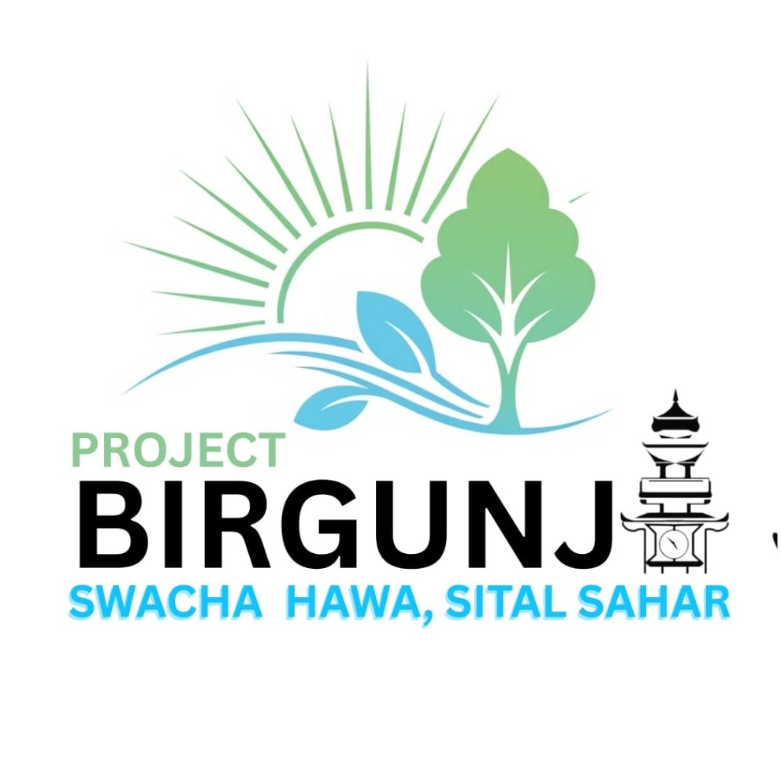

<p align="center">
  
</p>

# Birgunj Swacha Hawa: Sital Shara


> **Climate Visualization and Analysis for Birgunj City** 🌱

---

## ✨ About

Birgunj Swacha Hawa: Sital Shara is a modern web application for visualizing and analyzing climate data (temperature, humidity, and more) of Birgunj city using interactive charts and a clean UI.

---

## 🚀 Demo

[Live Demo Link](#) <!-- Replace with your live deploy URL if available -->

---

## 🖼️ Screenshots

<!-- Add real screenshots in the root folder and update the src below -->


---

## 🛠️ Tech Stack

- ⚛️ React.js + TypeScript
- 📊 Recharts (for data visualization)
- 💨 Tailwind CSS
- ⚡ Vite

---

## 📦 Installation

```bash
git clone https://github.com/Rahulchaube1/Birgunj-swach-hawa-sital-shara-.git
cd Birgunj-swach-hawa-sital-shara-
npm install
npm run dev
```

---

## 🌟 Features

- Interactive climate charts (temperature, humidity, etc.)
- Modular, reusable React components
- Responsive UI with Tailwind CSS
- Clean code structure & easy to extend

---

## 🙋‍♂️ Author & Contributors

<table>
  <tr>
    <td align="center">
      <b><span style="font-size:1.2em; background: #ffeead; padding: 2px 6px; border-radius: 4px;">Rahul Chaube</span></b> <br>
      
      <br/>
      <sub>Project Owner & Lead Developer</sub>
    </td>
    <td align="center">
      <b><span style="font-size:1.1em; background: #b3ffd9; padding: 2px 6px; border-radius: 4px;">Team Artistic Impression Research</span></b>
      <br/>
      
      <br/>
      <sub>Collaborators & Inspiration</sub>
    </td>
    <td align="center">
      <b><span style="font-size:1.1em; background: #ffe4e1; padding: 2px 6px; border-radius: 4px;">In Proud Collaboration with Birgunj Mahanagar Palika</span></b>
      <br/>
      
      <br/>
      <sub>Municipal Partner & Supporter</sub>
    </td>
  </tr>
</table>

---

## 🤝 Contributing

1. Fork the repo
2. Create your branch (`git checkout -b feature/AmazingFeature`)
3. Commit your changes (`git commit -m 'Add AmazingFeature'`)
4. Push to the branch (`git push origin feature/AmazingFeature`)
5. Open a Pull Request

---

## 📄 License

This project is licensed under the MIT License.

---

> Made by <b>Rahul Chaube</b>, <b>Team Artistic Impression Research</b> & <b>Birgunj Mahanagar Palika</b> for Birgunj's clean air initiative.